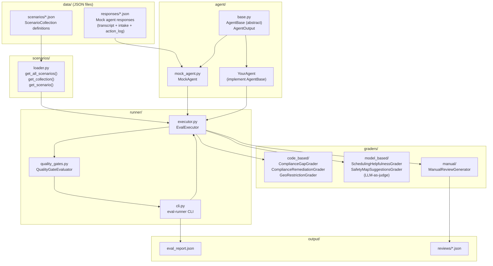
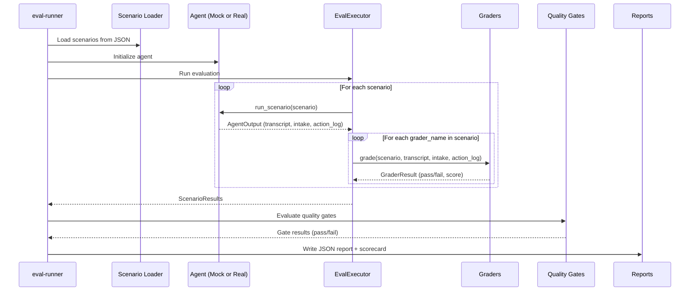

# Caregiver Intake Agent Evaluation System

An evaluation framework for testing caregiver intake agents. It runs scripted scenarios against an agent, grades responses using code-based and model-based graders, enforces quality gates, and produces scorecards and JSON reports.

## Architecture



### How It Works



## Quick Start

```bash
# Install dependencies
uv sync --dev

# Run all tests
uv run pytest -v

# Run evaluation with scorecard (skip model-based graders)
uv run eval-runner --scorecard --no-model-graders

# Run a specific scenario collection
uv run eval-runner -c compliance_missing_cases --scorecard --no-model-graders

# Run with model-based graders (requires ANTHROPIC_API_KEY)
export ANTHROPIC_API_KEY=sk-ant-...
uv run eval-runner --scorecard
```

## Project Structure

```
├── data/
│   ├── scenarios/           # Scenario definitions (JSON)
│   │   ├── compliance_missing_cases.json
│   │   ├── eligibility_improvement_cases.json
│   │   └── geo_over_restriction_cases.json
│   └── responses/           # Mock agent responses (JSON)
│       ├── compliance_cpr_missing.json
│       ├── compliance_cpr_unknown.json
│       ├── compliance_cpr_present.json
│       ├── geo_over_restricted.json
│       ├── geo_no_alternatives.json
│       └── elig_10*.json    # 10 eligibility scenarios
├── src/eval_caregiver/
│   ├── schemas/             # Pydantic data models
│   ├── scenarios/           # Scenario loader
│   ├── agent/               # Agent base class + mock agent
│   ├── graders/             # Code-based, model-based, manual graders
│   ├── runner/              # CLI, executor, quality gates
│   └── reporting/           # JSON reports, scorecard
├── tests/                   # Test suite (90 tests)
└── output/                  # Generated reports (git-ignored)
```

## Scenario Collections

| Collection | Scenarios | Description |
|---|---|---|
| `compliance_missing_cases` | 3 | Missing/unknown/valid CPR certification detection |
| `geo_over_restriction_cases` | 2 | Over-restricted geographic preferences |
| `eligibility_improvement_cases` | 10 | Compensation, shifts, health, transport, skills, environment, comfort, readiness |

## Graders

### Code-Based (deterministic, no API calls)

| Name | What It Checks |
|---|---|
| `compliance_gap_detection` | Agent found all expected compliance gaps |
| `compliance_remediation` | Agent offered remediation actions and scheduling |
| `geo_restriction_detection` | Agent flagged over-restriction and suggested safe alternatives |

### Model-Based (LLM-as-judge, requires `ANTHROPIC_API_KEY`)

| Name | What It Checks |
|---|---|
| `scheduling_helpfulness` | Clarity, options, and empathy in scheduling conversations |
| `safe_area_suggestion_quality` | Safety data references, zone identification, actionable next steps |

## Adding Scenarios

Scenarios and responses are plain JSON files. To add a new scenario:

1. **Add the scenario definition** to an existing collection JSON file in `data/scenarios/`, or create a new collection file.

2. **Add the mock response** as a new JSON file in `data/responses/<scenario_id>.json` with three keys:
   - `transcript` — conversation turns between agent and caregiver
   - `intake_record` — structured intake data the agent produced
   - `action_log` — actions the agent took

3. **Run tests** to validate the new data:
   ```bash
   uv run pytest tests/test_loader.py tests/test_json_responses.py -v
   ```

## Hooking Up a Real Agent

The evaluation framework is designed to work with any agent that implements the `AgentBase` interface.

### Step 1: Implement `AgentBase`

```python
from eval_caregiver.agent.base import AgentBase, AgentOutput
from eval_caregiver.schemas.caregiver import StructuredIntakeRecord
from eval_caregiver.schemas.conversation import AgentActionLog, ConversationTranscript
from eval_caregiver.schemas.scenarios import TestScenario


class MyIntakeAgent(AgentBase):
    """Your real caregiver intake agent."""

    def __init__(self, api_key: str):
        self.client = ...  # your LLM client, API connection, etc.

    def run_scenario(self, scenario: TestScenario) -> AgentOutput:
        # 1. Use scenario.caregiver_setup to configure the simulated caregiver
        # 2. Run your agent's intake conversation
        # 3. Extract structured data from the conversation

        transcript = ConversationTranscript(
            scenario_id=scenario.scenario_id,
            turns=[...],  # actual conversation turns
        )

        intake_record = StructuredIntakeRecord(
            caregiver=...,          # profile extracted by agent
            compliance_gaps=[...],  # gaps the agent identified
            remediation_actions=[...],
            geo_concerns=[...],
            safe_area_suggestions=[...],
            overall_status="...",
        )

        action_log = AgentActionLog(
            scenario_id=scenario.scenario_id,
            actions=[...],            # what the agent did
            compliance_items_checked=[...],
            safety_map_consulted=...,
            scheduling_offered=...,
            remediation_steps_offered=[...],
        )

        return AgentOutput(
            transcript=transcript,
            intake_record=intake_record,
            action_log=action_log,
        )
```

### Step 2: Wire It Into the Runner

Update `src/eval_caregiver/runner/cli.py` to use your agent instead of `MockAgent`:

```python
# Replace:
agent = MockAgent()

# With:
agent = MyIntakeAgent(api_key=os.environ["MY_AGENT_API_KEY"])
```

Or create a separate evaluation script:

```python
from eval_caregiver.runner.executor import EvalExecutor
from eval_caregiver.scenarios.loader import get_all_scenarios
from my_agent import MyIntakeAgent

agent = MyIntakeAgent(api_key="...")
graders = _build_grader_registry()  # from cli.py
executor = EvalExecutor(agent=agent, graders=graders, skip_model_graders=False)

results = executor.run_scenarios(get_all_scenarios())
for result in results:
    print(f"{result.scenario_name}: {'PASS' if result.passed else 'FAIL'} ({result.overall_score:.2f})")
```

### Step 3: Run the Evaluation

```bash
# With your real agent
export MY_AGENT_API_KEY=...
export ANTHROPIC_API_KEY=...  # for model-based graders
uv run eval-runner --scorecard
```

### What Your Agent Needs to Produce

The graders inspect three outputs from your agent:

| Output | Used By | Key Fields |
|---|---|---|
| `ConversationTranscript` | Model-based graders | `turns` with role/content |
| `StructuredIntakeRecord` | Code-based graders | `compliance_gaps`, `remediation_actions`, `geo_concerns`, `safe_area_suggestions` |
| `AgentActionLog` | Code-based graders | `compliance_items_checked`, `safety_map_consulted`, `scheduling_offered`, `remediation_steps_offered` |

The code-based graders compare your agent's output against the scenario's `expected_compliance_gaps` and `expected_geo_concerns`. The model-based graders evaluate conversation quality using rubric-based LLM judging.
